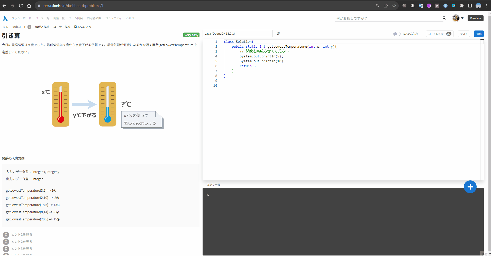
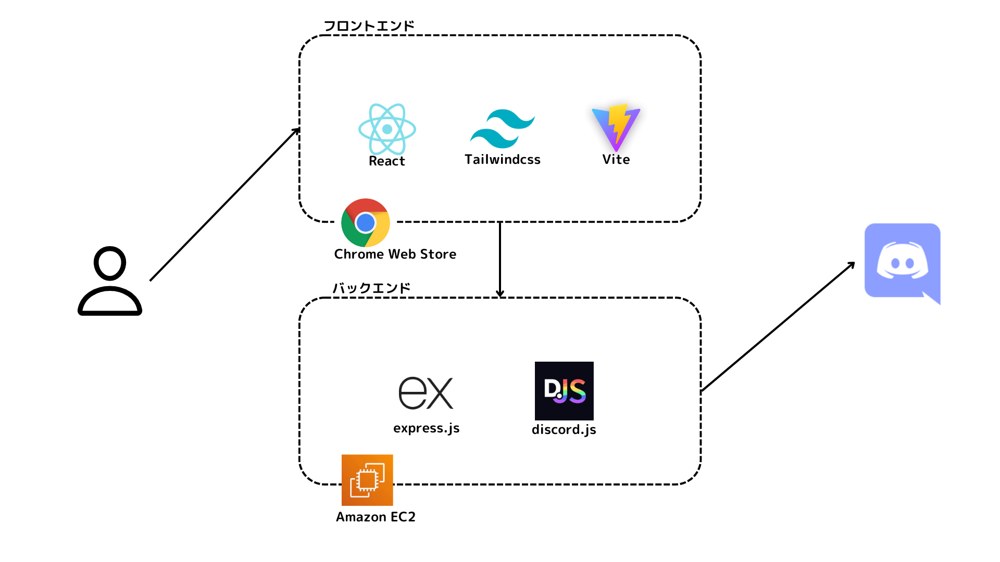

<h3 align="center">
    
</h3>

[recursionist.io](recursionist.io)での学習効率を高める拡張機能です。

問題ページから[RePOST](https://chrome.google.com/webstore/detail/repost/ncecccibmoomlikfocmpmidbhiioonlm)を使用することで、Recursionコミュニティへ質問をすることができます。

RePOSTは、Recustionコミュニティの質問テンプレートに沿って作成していおり、毎回コピー＆ペーストをする個所は自動で読み込まれるため、ユーザーは質問のテキストを記述することに集中できます。
また、言語別でシンタックスハイライトに対応しており、最終的な Discord メッセージのプレビューを用意しているため、読みやすいDiscordメッセージを投稿することができます。

## 使用方法
1. [chrome拡張機能ストア](https://chrome.google.com/webstore/detail/repost/ncecccibmoomlikfocmpmidbhiioonlm)にて RePOST をインストールする。
2. 右上の拡張機能に RePOST をピン止めする。
3. recursionist.ioでの問題ページを開く。
4. RePOST の icon クリックする。
5. Discordとの連携をする。
6. 質問タブにて記述していく。
7. [ コード, コンソール, プレビュー ] を確認する。
8. 問題なければ、質問ボタンをクリックして投稿する。

## URL
https://chrome.google.com/webstore/detail/repost/ncecccibmoomlikfocmpmidbhiioonlm

## システム構成図

## ワイヤーフレーム
[Figma](https://www.figma.com/file/wPjO41fDIQYHRdLW7xzKqV/recursion_question?type=design&node-id=0%3A1&mode=design&t=Hr7K02YIxORFJuma-1)にて作成

## 使用技術
|カテゴリ|技術|
|----|----|
|フロントエンド|Typescript React Tailwindcss|
|バックエンド|express.js discord.js|
|インフラ|ChromeWebStore EC2|
|ビルド|Vite|
|CI|husky|
|...etc|eslint prettier|